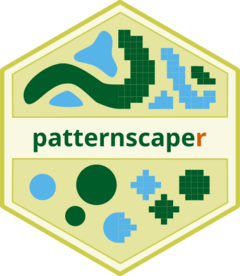

<!-- README.md is generated from README.Rmd. Please edit that file -->

# patternscaper <a href="https://ecomods.github.io/patternscaper/"></a>

<!-- badges: start -->

[](https://github.com/ecomods/patternscaper/actions/workflows/R-CMD-check.yaml)
[](https://www.gnu.org/licenses/gpl-3.0.html)
<!-- badges: end -->

`patternscaper` classifies spatial vegetation patterns into user-defined
classes using neural networks trained on reference landscapes with known
patterns. It supports two workflows: a multilayer neural network trained
on landscape metrics and a convolutional neural network trained directly
on raster cells. Trained models can then be used to classify new
landscapes.

In the companion paper, we demonstrate both workflows for ecotone and
self-organized vegetation patterns, and evaluate the model performance
across different parameter settings. We also demonstrate that a model
trained on artificial landscapes can be applied to classify real
landscapes from remote sensing imagery.


## Installation

Install the development version of patternscaper from
[GitHub](https://github.com/ecomods/patternscaper):

``` r
# install.packages("pak")
pak::pak("ecomods/patternscaper")
```

## Get started

See [Get
started](https://ecomods.github.io/patternscaper/articles/patternscaper.html)
for the classification workflow.

## Citation

To cite `patternscaper`, use:

Baldauf, S., Tietjen, B., & Berger, U. (2025). patternscaper: An R
package for classifying spatial landscape patterns using neural
networks. *Methods in Ecology and Evolution*. In review.

Run `citation("patternscaper")` for the BibTeX entry.

## Contributing

See the [contributing
guide](https://ecomods.github.io/patternscaper/CONTRIBUTING.html) to get
involved.

## Code of Conduct

Contributions are governed by the project [Code of
Conduct](https://ecomods.github.io/patternscaper/CODE_OF_CONDUCT.html).
