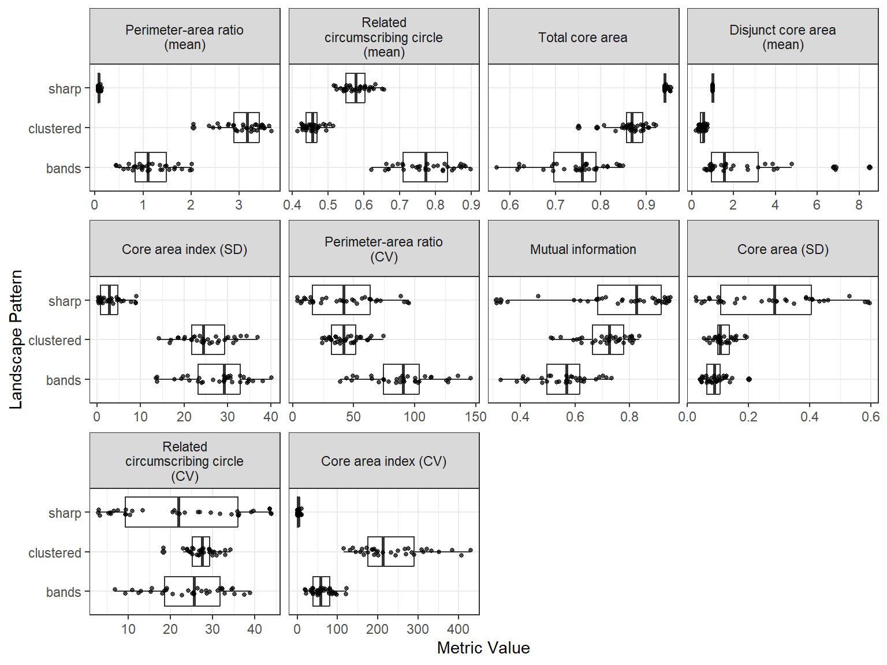
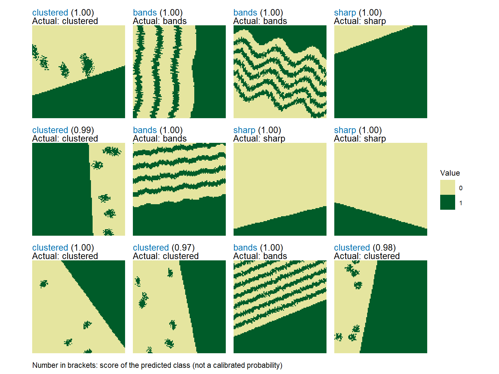

# Classify landscapes using landscape metrics

This vignette provides an overview of the workflow to train a neural
network on landscape metrics and then use the trained network to
classify new landscapes based on the same metrics.

``` r

library(spatPatClassifyR)

# Set seed for reproducibility
set.seed(123456)
```

The workflow consists of the following steps:

1.  Generate training landscapes with known patterns using the
    [`create_landscapes()`](https://ecomods.github.io/spatPatClassifyR/reference/create_landscapes.md)
    function.
2.  Calculate landscape metrics for the training landscapes using the
    [`calculate_landscape_metrics()`](https://ecomods.github.io/spatPatClassifyR/reference/calculate_landscape_metrics.md)
    function.
3.  Select most informative metrics (i.e. metrics that differ the most
    between landscapes) using the
    [`evaluate_landscape_metrics()`](https://ecomods.github.io/spatPatClassifyR/reference/evaluate_landscape_metrics.md)
    function.
4.  Train a neural network using the selected metrics with the
    [`train_nn_metrics()`](https://ecomods.github.io/spatPatClassifyR/reference/train_nn_metrics.md)
    function.
5.  Classify new landscapes using the trained neural network with the
    [`apply_nn_metrics()`](https://ecomods.github.io/spatPatClassifyR/reference/apply_nn_metrics.md)
    function.

## Step 1: Generate Training Landscapes

You can generate a set of training landscapes with known patterns. See
[landscape generation
vignette](https://ecomods.github.io/spatPatClassifyR/articles/landscape-generation.md)
for details on landscape generation and available patterns and options.

``` r

# Generate 100 training landscapes of 3 patterns
landscapes <- create_landscapes(
  n = 100,
  patterns = c("labyrinth", "random", "clustered")
)
#> ✔ Successfully generated all 100 training landscapes
```

## Step 2: Calculate Landscape Metrics

Next, you can calculate landscape metrics for the training landscapes.
Landscape metrics are calculated using the metrics and functions from
the
[`landscapemetrics`](https://r-spatialecology.github.io/landscapemetrics/)
package. They can be calculated on the class level (i.e. for each land
cover class separately) or on the landscape level (i.e. for the whole
landscape). For details, see [landscape metrics
vignette](https://ecomods.github.io/spatPatClassifyR/articles/landscape-metrics.md).

In this example, we calculate metrics on the landscape level.

``` r

# Calculate landscape metrics on the landscape level
landscape_metrics <- calculate_landscape_metrics(
  landscapes,
  level = "landscape"
)
```

## Step 3: Evaluate Landscape Metrics

You can use the `evaluate_landscape_metrics` function to select the n
(e.g. n=10) most informative metrics for classification based on
different methods. Here, we use the effect size of a Kruskal-Wallis H
test (for more details and other options see [landscape metrics
vignette](https://ecomods.github.io/spatPatClassifyR/articles/landscape-metrics.md)).

> **Note**
>
> Note, that some metrics may return `NA` for some landscapes. Also,
> some metrics may have the same value for each landscape (zero variance
> between the values). By default, these metrics are removed before
> evaluation and the user gets warned about the metrics that are
> removed.
>
> It is not recommended to set `exclude_na = FALSE`, as metrics with
> `NA` values cannot be used for training the neural network. They may
> however be informative and useful for other types of analyses.

``` r

best_10 <- evaluate_landscape_metrics(
  metrics = landscape_metrics,
  method = "kruskal_effsize",
  metrics_number = 10,
  verbose = FALSE
)
#> Warning: Excluded 600 rows containing 6 metrics with NA values. Metrics removed:
#> "enn_cv", "enn_mn", "enn_sd", "iji", "pafrac", and "rpr" Use
#> `exclude_NA_metrics = FALSE` to retain (not recommended for model training)
#> Warning: Excluded 1 metrics with zero variance: "pr"
```

Alternatively, you can manually select the metrics you want to use for
further evaluation. For this, just provide a list of the metric names
you are interested in.

You can plot the differences between patterns for the selected metrics
using the `plot_metrics` function.

``` r

# Plot selected metrics
plot_metrics(
  metrics = landscape_metrics,
  selected_metrics = best_10
)
```



Boxplots show the distribution of the selected landscape metrics across
different spatial patterns. Each point represents one training landscape
and each panel is one of the selected metrics.

## Step 4: Train Neural Network

The model can now be trained using the selected metrics from step 3.
Training can be done with or without cross-validation. Valid options for
the cross-validation method `cv_method` are:

- `"none"`: no cross-validation
- `"k-fold"`: k-fold cross-validation with `cv_folds` number of folds
- `"loo"`: leave-one-out cross-validation

For details and further options see the function help
`?train_nn_metrics()`.

``` r

# Train neural network with k-fold cross-validation (3 folds)
model <- train_nn_metrics(
  metrics = landscape_metrics,
  metrics_selected = best_10,
  cv_method = "k-fold",
  cv_folds = 3,
  verbose = FALSE
)
```

To check the model performance, you can look at the confusion matrix
from cross-validation:

``` r

# Confusion matrix from cross-validation
model$performance$confusion_matrix
#>            Actual
#> Predicted   clustered labyrinth random
#>   clustered        29         3      0
#>   labyrinth         4        31      0
#>   random            0         0     33
```

You can also check other performance metrics like overall accuracy:

``` r

# Overall accuracy
model$performance$accuracy
#> [1] 0.93
```

Or per class metrics like precision, recall, and F1-score:

``` r

model$performance$per_class_metrics
#> # A tibble: 3 × 5
#>   class     count recall precision f1_score
#>   <chr>     <int>  <dbl>     <dbl>    <dbl>
#> 1 clustered    33   0.88      0.91     0.89
#> 2 labyrinth    34   0.91      0.89     0.9 
#> 3 random       33   1         1        1
```

## Step 5: Classify New Landscapes

Finally, you can create some new test landscapes and classify them using
the trained model. In this example, we create 10 new landscapes for
testing.

In reality these could be landscapes read in from files or created in
other ways (e.g. outputs of simulation models). For details on importing
own landscapes, see the [importing landscapes
vignette](https://ecomods.github.io/spatPatClassifyR/articles/importing-landscapes.md).

``` r

# Create 10 new test landscapes using the same patterns as for training
test_landscapes <- create_landscapes(
  n = 10,
  patterns = c("labyrinth", "random", "clustered")
)
#> ✔ Successfully generated all 10 training landscapes
```

If test landscapes have been created with
[`create_landscapes()`](https://ecomods.github.io/spatPatClassifyR/reference/create_landscapes.md),
their true patterns are known. Therefore they can be used to evaluate
classification performance.

> **Note**
>
> To get additional performance metrics, set `return_performance = TRUE`
> when applying the model. This only works if true patterns are known.
> If true patterns are not known, set `return_performance = FALSE`
> (default).

``` r

# Classify test landscapes using the trained model
classification <- apply_nn_metrics(
  landscapes = test_landscapes,
  nn_model = model,
  return_performance = TRUE
)
#>            Actual
#> Predicted   clustered labyrinth random
#>   clustered         3         0      0
#>   labyrinth         0         4      0
#>   random            0         0      3
#> # A tibble: 3 × 5
#>   class     count recall precision f1_score
#>   <chr>     <int>  <dbl>     <dbl>    <dbl>
#> 1 clustered     3      1         1        1
#> 2 labyrinth     4      1         1        1
#> 3 random        3      1         1        1
```

You can look at the predicted patterns for each test landscape
individually and compare actual and predicted classes:

``` r

# Predicted patterns
classification$predictions
#> # A tibble: 10 × 8
#>    landscape_id landscape_name actual_class predicted_class confidence clustered
#>           <int> <chr>          <chr>        <chr>                <dbl>     <dbl>
#>  1            1 clustered_1_r… clustered    clustered            0.577     0.577
#>  2            2 random_2       random       random               0.576     0.212
#>  3            3 clustered_3_r… clustered    clustered            0.577     0.577
#>  4            4 random_4       random       random               0.577     0.211
#>  5            5 labyrinth_5    labyrinth    labyrinth            0.537     0.253
#>  6            6 random_6       random       random               0.576     0.212
#>  7            7 labyrinth_7    labyrinth    labyrinth            0.535     0.242
#>  8            8 clustered_8_r… clustered    clustered            0.577     0.577
#>  9            9 labyrinth_9    labyrinth    labyrinth            0.568     0.218
#> 10           10 labyrinth_10   labyrinth    labyrinth            0.490     0.275
#> # ℹ 2 more variables: labyrinth <dbl>, random <dbl>
```

You can also look at performance summaries like confusion matrix:

``` r

# Performance summary
classification$performance$confusion_matrix
#>            Actual
#> Predicted   clustered labyrinth random
#>   clustered         3         0      0
#>   labyrinth         0         4      0
#>   random            0         0      3
```

And other metrics like accuracy, precision, recall, and F1-score:

``` r

# Other performance metrics
classification$performance$per_class_metrics
#> # A tibble: 3 × 5
#>   class     count recall precision f1_score
#>   <chr>     <int>  <dbl>     <dbl>    <dbl>
#> 1 clustered     3      1         1        1
#> 2 labyrinth     4      1         1        1
#> 3 random        3      1         1        1
```

To visualize the classified landscapes along with their true and
predicted patterns use the function `plot_classified_landscapes`.
Correctly classified landscapes are shown in green, misclassified ones
in red. To plot only misclassified landscapes, set
`only_misclassified = TRUE`.

> **Note**
>
> If you classified landscapes where the true patterns are not known,
> the plot will show the landscape and the predicted pattern only.

``` r

# Visualize true and predicted patterns

plot_classified_landscapes(
  classification = classification$predictions,
  landscapes = test_landscapes
)
```


