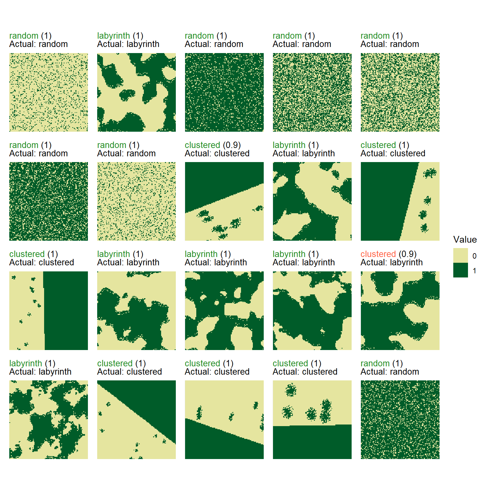

# Classify landscapes using Keras on landscape rasters

This vignette shows how to classify landscape patterns using a
convolutional neural network (Keras backend) trained directly on
landscape raster data.

``` r
library(spatPatClassifyR)
```

The workflow consists of the following steps:

1.  Generate training landscapes with known patterns using the
    [`create_landscapes()`](https://ecomods.github.io/spatPatClassifyR/reference/create_landscapes.md)
    function.
2.  Train a neural network on the landscape pixel data using the
    [`train_nn_pixels()`](https://ecomods.github.io/spatPatClassifyR/reference/train_nn_pixels.md)
    function.
3.  Classify new landscapes using the trained model with the
    [`apply_nn_pixels()`](https://ecomods.github.io/spatPatClassifyR/reference/apply_nn_pixels.md)
    function.

## Setup Keras

Models are trained using the R package `keras3`. It requires a working
installation of TensorFlow.

You can refer to our [installation
guide](https://ecomods.github.io/spatPatClassifyR/articles/install-keras.md)
and the official [`keras3` package website](https://keras3.posit.co/)
for instructions on how to install Keras and TensorFlow.

To quickly test if your setup is working, you can run the following
simple function from the `keras3` package:

``` r
keras3::to_categorical(0)
#>      [,1]
#> [1,]    1
```

If the function does not return an error, your Keras installation is
working correctly.

## Set seed for reproducibility

Keras models do not use R’s random number generator (RNG). Therefore, it
is not enough to set a seed with
[`set.seed()`](https://rdrr.io/r/base/Random.html). To set both a seed
for R and for Keras RNG, you can use the
[`set_random_seed()`](https://ecomods.github.io/spatPatClassifyR/reference/set_random_seed.md)
function from `spatPatClassifyR`.

``` r
set_random_seed(123456)
```

## Step 1: Generate Training Landscapes

You can generate a set of training landscapes with known patterns. See
[landscape generation
vignette](https://ecomods.github.io/spatPatClassifyR/articles/landscape-generation.md)
for details on landscape generation and available patterns and options.

``` r
training_landscapes <- create_landscapes(
  n = 100,
  patterns = c("labyrinth", "random", "clustered")
)
#> ✔ Successfully generated all 100 training landscapes
```

## Step 2: Train Neural Network

The model can be trained with or without cross-validation. Valid methods
for the cross-validation method `cv_method` are:

- `"none"`: No cross-validation, train on all data.
- `"kfold"`: k-fold cross-validation with `cv_folds` number of folds.
- `"loo"`: leave-one-out cross-validation.

For details and further options see the function help of
[`train_nn_pixels()`](https://ecomods.github.io/spatPatClassifyR/reference/train_nn_pixels.md).

Description of model architecture still missing.

Here, we train the model using 2-fold cross-validation to keep
computational time low.

> **Low fold accuaracy**
>
> The function will print fold accuracies during training (see below).
> If the accuracy is low, consider increasing the number of training
> landscapes or check the function help for other options to improve
> model performance.

``` r
model <- train_nn_pixels(
  landscapes = training_landscapes,
  cv_method = "k-fold",
  cv_folds = 2,
  verbose = FALSE
)
```

To check the model performance, we can look at the confusion matrix from
cross-validation:

``` r
# Confusion matrix from cross-validation
model$performance$confusion_matrix
#>            Actual
#> Predicted   clustered labyrinth random
#>   clustered        27        10      0
#>   labyrinth         6        24      0
#>   random            0         0     33
```

You can also check other performance metrics like overall accuracy:

``` r
# Overall accuracy
model$performance$accuracy
#> [1] 0.84
```

Or per class metrics like precision, recall, and F1-score:

``` r
model$performance$per_class_metrics
#> # A tibble: 3 × 5
#>   class     count recall precision f1_score
#>   <chr>     <int>  <dbl>     <dbl>    <dbl>
#> 1 clustered    33   0.82      0.73     0.77
#> 2 labyrinth    34   0.71      0.8      0.75
#> 3 random       33   1         1        1
```

## Step 3: Classify New Landscapes

Finally, you can create some new test landscapes and classify them using
the trained model. In this example, we create 20 new landscapes for
testing.

In reality this could be landscapes read in from files or created in
other ways. For details on importing own landscapes, see the [importing
landscapes
vignette](https://ecomods.github.io/spatPatClassifyR/articles/importing-landscapes.md).

``` r
test_landscapes <- create_landscapes(
  n = 20,
  patterns = c("labyrinth", "random", "clustered")
)
#> ✔ Successfully generated all 20 training landscapes
```

If test landscapes have been created with
[`create_landscapes()`](https://ecomods.github.io/spatPatClassifyR/reference/create_landscapes.md),
their true patterns are known. Therefore they can be used to evaluate
classification performance.

> **Note**
>
> To get additional performance metrics, set `return_performance = TRUE`
> when applying the model. This only works if true patterns are known.
> If true patterns are not known, set `return_performance = FALSE`
> (default).

``` r
classification <- apply_nn_pixels(
  landscapes = test_landscapes,
  nn_model = model,
  return_performance = TRUE
)
```

You can look at the predicted patterns for each test landscape
individually and compare actual and predicted classes:

``` r
# Predicted patterns
classification$predictions
#> # A tibble: 20 × 8
#>    landscape_id landscape_name actual_class predicted_class confidence clustered
#>           <int> <chr>          <chr>        <chr>                <dbl>     <dbl>
#>  1            1 random_1       random       random               1.000 2.16 e- 7
#>  2            2 labyrinth_2    labyrinth    labyrinth            0.996 3.70 e- 3
#>  3            3 random_3       random       random               1.000 3.71 e- 5
#>  4            4 random_4       random       random               1     2.87 e-11
#>  5            5 random_5       random       random               1     5.76 e-12
#>  6            6 random_6       random       random               1.000 4.54 e- 8
#>  7            7 random_7       random       random               1.000 5.80 e- 8
#>  8            8 clustered_8_r… clustered    clustered            0.902 9.02 e- 1
#>  9            9 labyrinth_9    labyrinth    labyrinth            1.000 4.92 e- 5
#> 10           10 clustered_10_… clustered    clustered            0.997 9.97 e- 1
#> 11           11 clustered_11_… clustered    clustered            1.000 1.000e+ 0
#> 12           12 labyrinth_12   labyrinth    labyrinth            1.000 8.50 e- 5
#> 13           13 labyrinth_13   labyrinth    labyrinth            1.000 3.00 e- 4
#> 14           14 labyrinth_14   labyrinth    labyrinth            1.000 8.62 e- 6
#> 15           15 labyrinth_15   labyrinth    clustered            0.896 8.96 e- 1
#> 16           16 labyrinth_16   labyrinth    labyrinth            1.000 2.86 e- 5
#> 17           17 clustered_17_… clustered    clustered            1.000 1.000e+ 0
#> 18           18 clustered_18_… clustered    clustered            1.000 1.000e+ 0
#> 19           19 clustered_19_… clustered    clustered            1.000 1.000e+ 0
#> 20           20 random_20      random       random               1.000 3.88 e- 7
#> # ℹ 2 more variables: labyrinth <dbl>, random <dbl>
```

You can also look at performance summaries like confusion matrix:

``` r
# Performance summary
classification$performance$confusion_matrix
#>            Actual
#> Predicted   clustered labyrinth random
#>   clustered         6         1      0
#>   labyrinth         0         6      0
#>   random            0         0      7
```

And other metrics like accuracy, precision, recall, and F1-score:

``` r
# Other performance metrics
classification$performance$per_class_metrics
#> # A tibble: 3 × 5
#>   class     count recall precision f1_score
#>   <chr>     <int>  <dbl>     <dbl>    <dbl>
#> 1 clustered     6   1         0.86     0.92
#> 2 labyrinth     7   0.86      1        0.92
#> 3 random        7   1         1        1
```

To visualize the classified landscapes along with their true and
predicted patterns use the function `plot_classified_landscapes`.
Correctly classified landscapes are shown in green, misclassified ones
in red. To plot only misclassified landscapes, set
`only_misclassified = TRUE`.

> **Note**
>
> If you classified landscapes where the true patterns are not known,
> the plot will show the landscape and the predicted pattern only.

``` r
# Visualize true and predicted patterns

plot_classified_landscapes(
  classification = classification$predictions,
  landscapes = test_landscapes
)
```


