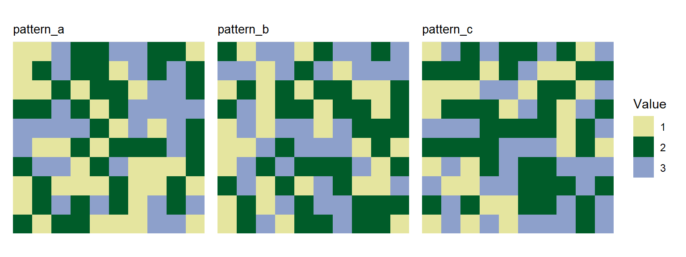

# Importing user-defined landscapes

In addition to using landscapes generated with the functions in
`spatPatClassifyR`, you can also import your own landscapes to use them
for training or classification. These can be landscapes created manually
as matrices or rasters, or landscapes read in from files (e.g. from
classified remote sensing images).

Please note that right now, we only support landscapes with categorical
cover classes.

``` r
library(spatPatClassifyR)
```

All functions in `spatPatClassifyR` expect landscapes to be a
`landscape` object or a list of `landscape` objects. You can convert
your own landscapes to `landscape` objects using the
[`landscape()`](https://ecomods.github.io/spatPatClassifyR/reference/landscape.md)
function.

You can convert landscapes from a matrix or a `SpatRaster` (provided
from the [`terra` R
package](https://rspatial.github.io/terra/index.html)).

``` r
# Create a sample matrix
landscape_matrix <- matrix(
  data = sample(1:3, 100, replace = TRUE),
  nrow = 10,
  ncol = 10
)

# Create a sample SpatRaster
landscape_raster <- terra::rast(landscape_matrix)
```

To convert these to `landscape` objects, use the
[`landscape()`](https://ecomods.github.io/spatPatClassifyR/reference/landscape.md)
function. The landscape object contains metadata about the landscape,
such as its name and pattern. By default, the `name` is set to
`"unnamed"` and the `pattern` to `"unclassified"`.

You can provide name and pattern when converting the landscape.

> **Note**
>
> Providing a landscape pattern is only necessary if you want to use the
> landscape for training a model. If you want to classify landscapes
> without known patterns, you can leave the pattern as `"unclassified"`.

``` r
# Convert the matrix to a landscape object
landscape_object_matrix <- landscape(
  landscape_matrix,
  name = "Sample Matrix Landscape",
  pattern = "custom"
)
# Convert the SpatRaster to a landscape object
landscape_object_raster <- landscape(
  landscape_raster,
  name = "Sample Raster Landscape",
  pattern = "custom"
)
```

Printing a landscape object shows its properties:

``` r
landscape_object_matrix
#> Landscape: "Sample Matrix Landscape" [ pattern: custom ]
#> -----------------------------------------
#> Dimensions: 10x10 (100 cells)
#> Resolution: 1.0x1.0
#> Extent    : xmin=0.0, xmax=10.0, ymin=0.0, ymax=10.0
#> Values    : min=1.0, max=3.0
#> Parameters: none
```

## Bulk-converting multiple landscapes

If you have multiple landscapes to convert, you can use use `lapply` or
the `pmap` function from the [`purrr`
package](https://purrr.tidyverse.org/) to apply the
[`landscape()`](https://ecomods.github.io/spatPatClassifyR/reference/landscape.md)
function to each landscape in a list.

Below you find an example of bulk-converting multiple matrices to
landscape objects and setting their names and patterns accordingly.

``` r
library(purrr)
# Create a list of sample matrices
landscape_matrices <- list(
  matrix1 = matrix(sample(1:3, 100, replace = TRUE), nrow = 10),
  matrix2 = matrix(sample(1:3, 100, replace = TRUE), nrow = 10),
  matrix3 = matrix(sample(1:3, 100, replace = TRUE), nrow = 10)
)
# Define a vector with landscape names for each landscape
landscape_names <- c("Landscape 1", "Landscape 2", "Landscape 3")
# Define a vector with landscape patterns for each landscape
landscape_patterns <- c("pattern_a", "pattern_b", "pattern_c")

# Convert the list of matrices to a list of landscape objects
landscape_objects <- pmap(
  list(
    landscape_matrices,
    landscape_names,
    landscape_patterns
  ),
  function(mat, name, pattern) {
    landscape(mat, name = name, pattern = pattern)
  }
)
```

After converting the landscapes, you can use them like any other
landscape object in `spatPatClassifyR`. You can for example use the
plotting functions to visualize them:

``` r
plot_landscape_list(landscape_objects)
```


