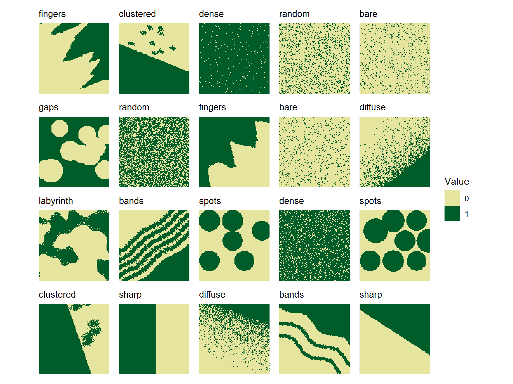

# Generate landscapes with different spatial patterns

This vignette shows how to generate artificial landscapes with different
spatial patterns. These landscapes are designed for training and testing
spatial pattern classifiers. For details on how to use the generated
landscapes for training classifiers, see the
[classify-metrics](https://ecomods.github.io/spatPatClassifyR/articles/classify-metrics.md)
and
[classify-pixels](https://ecomods.github.io/spatPatClassifyR/articles/classify-pixels.md)
vignettes.

``` r

library(spatPatClassifyR)
# Set seed for reproducibility
set.seed(123456)
```

## Overview

You can:

- Generate batches of training landscapes with
  [`create_landscapes()`](https://ecomods.github.io/spatPatClassifyR/reference/create_landscapes.md)
- Create individual landscapes with custom parameters using
  [`create_landscape()`](https://ecomods.github.io/spatPatClassifyR/reference/create_landscape.md)
- Visualize an individual landscape with
  [`plot_landscape()`](https://ecomods.github.io/spatPatClassifyR/reference/plot_landscape.md)
- Visualize multiple landscapes in a grid with
  [`plot_landscape_list()`](https://ecomods.github.io/spatPatClassifyR/reference/plot_landscape_list.md)

### Available patterns

Currently, there are 11 different spatial patterns available:

#### Control patterns

- **random**: Randomly distributed vegetation
- **bare**: No/minimal vegetation (control)
- **dense**: Complete/maximal vegetation cover (control)


#### Ecotone patterns

- **sharp**: Sharp boundary
- **diffuse**: Gradual transition
- **fingers**: Curvy, finger-like extensions
- **clustered**: Vegetation clusters above a treeline
- **bands**: Sinusoidal vegetation bands


#### Patch patterns

- **spots**: Circular vegetation patches
- **gaps**: Circular vegetation gaps
- **labyrinth**: Maze-like vegetation patterns


For detailed parameter descriptions and examples of each pattern type,
see
[`?create_landscape`](https://ecomods.github.io/spatPatClassifyR/reference/create_landscape.md).

## Creating Multiple Training Landscapes

The quickest way to generate training data is with
[`create_landscapes()`](https://ecomods.github.io/spatPatClassifyR/reference/create_landscapes.md).
It generates multiple landscapes balanced across all available patterns.

``` r

# Create 20 landscapes balanced across all pattern types
landscapes <- create_landscapes(n = 20)
#> ✔ Successfully generated all 20 training landscapes
```

The `landscapes` are returned as a list of `landscape` objects (see
[below](https://ecomods.github.io/spatPatClassifyR/articles/landscape-generation.qmd#landscape-object-structure)
for more info on the data structure).

They can be visualized using the
[`plot_landscape_list()`](https://ecomods.github.io/spatPatClassifyR/reference/plot_landscape_list.md)
function:

``` r

# Plot all landscapes
plot_landscape_list(landscapes)
```



By default, landscapes are created in a balanced way, so that each
pattern type is represented equally in the generated set.

``` r

# Check how many landscapes of each type were generated
table(purrr::map_chr(landscapes, ~ .x$pattern))
#> 
#>     bands      bare clustered     dense   diffuse   fingers      gaps labyrinth 
#>         2         2         2         2         2         2         1         1 
#>    random     sharp     spots 
#>         2         2         2
```

### Selecting Specific Patterns

Specific patterns can be selected to create only a subset of patterns
using the `patterns` argument. For example, to create landscapes with
only labyrinth, spots, and clustered patterns:

``` r

# Generate only specific patterns
landscapes <- create_landscapes(
  n = 12,
  patterns = c("labyrinth", "spots", "clustered")
)
#> ✔ Successfully generated all 12 training landscapes

plot_landscape_list(landscapes)
```


### Control landscape parameters

#### Landscape size

To modify the size (number of pixels in x- and y-direction) of all
generated landscapes, use the `ncol` and `nrow` arguments. By default,
landscapes are created with a size of 100x100 pixels.

``` r

non_square <- create_landscapes(
  n = 3,
  width = 50,
  height = 20
)
#> ✔ Successfully generated all 3 training landscapes
# Plot landscapes with custom size
plot_landscape_list(non_square)
```


#### Landscape rotation

By default, landscapes are rotated by angles randomly chosen between 0
and 360 degrees. This ensures that classifiers trained on these
landscapes are invariant to landscape orientation.

You can disable random rotation by setting the `rotation` parameter to
`0`. This parameter can also be used to directly control the range of
selected rotation angles. For example, to select only angles between 0
and 90 degrees:

``` r

no_rotation <- create_landscapes(
  n = 3,
  patterns = c("clustered", "sharp", "bands"),
  rotation = 0
)

defined_angles <- create_landscapes(
  n = 3,
  patterns = "clustered",
  rotation = c(45, 90)
)

plot_landscape_list(c(no_rotation, defined_angles))
```


#### Pattern-specific parameters

You can modify default parameters for all generated landscapes of a
specific pattern by passing a list of parameter values to the
`params_list` argument. For example, to create landscapes with more
spots of larger size:

``` r

# Custom parameters for spot patterns
pattern_params <- list(
  spots = list(
    n_spots = 15,
    spot_radius = 10,
    spot_radius_sd = 3
  )
)
bigger_spots <- create_landscapes(
  n = 12,
  patterns = "spots",
  params_list = pattern_params
)

plot_landscape_list(bigger_spots)
```


To check parameter names and default values for each pattern type, see
the function help
[`create_landscape()`](https://ecomods.github.io/spatPatClassifyR/reference/create_landscape.md).

## Creating Single Landscapes

To create single landscapes of all patterns with specific parameters,
use the
[`create_landscape()`](https://ecomods.github.io/spatPatClassifyR/reference/create_landscape.md)
function. Check the help page
[`?create_landscape`](https://ecomods.github.io/spatPatClassifyR/reference/create_landscape.md)
for a full list of available parameters for each pattern type.

### Spot Patterns

``` r

# Default spots
spots_default <- create_landscape("spots", name = "Default")

# More spots with size variation
spots_many <- create_landscape(
  "spots",
  name = "Many variable spots",
  n_spots = 15,
  spot_radius = 8,
  spot_radius_sd = 2
)

# Regular grid of spots
spots_regular <- create_landscape(
  "spots",
  name = "Regular grid",
  n_spots = 15,
  spot_radius = 20,
  spot_radius_sd = 0,
  regular_spots = TRUE
)
#> Warning: Regular spot placement requested 15 spots but only ~6 positions fit.
#> ℹ  Adjusting to maximum feasible spots. Consider decreasing `spot_radius`.

plot_landscape_list(
  list(spots_default, spots_many, spots_regular),
  titles = "name"
)
```


### Clustered Patterns

``` r

# Few large clusters
clustered_large <- create_landscape(
  "clustered",
  name = "Few large clusters",
  n_clusters = 5,
  cluster_radius = 12,
  scatter_zone_prop = 0.5
)

# Many small clusters
clustered_small <- create_landscape(
  "clustered",
  name = "Many small clusters",
  n_clusters = 30,
  cluster_radius = 2,
  scatter_zone_prop = 0.6
)

# Elongated clusters
clustered_horizontal <- create_landscape(
  "clustered",
  name = "Horizontal clusters",
  n_clusters = 15,
  cluster_radius = 5,
  elongation_x = 3,
  elongation_y = 1,
  scatter_zone_prop = 0.4
)

plot_landscape_list(
  list(
    clustered_large,
    clustered_small,
    clustered_horizontal
  ),
  titles = "name"
)
```


### Labyrinth Patterns

``` r

# Default labyrinth
labyrinth_default <- create_landscape("labyrinth", name = "Default")

# Higher frequency with multiple octaves
labyrinth_complex <- create_landscape(
  "labyrinth",
  name = "Complex",
  frequency = 8,
  octaves = 3,
  band_fuzziness = 0.05
)

plot_landscape_list(list(labyrinth_default, labyrinth_complex), titles = "name")
```


## The landscape Object

In `spatPatClassifyR`, landscapes are stored as lists containing the
landscape data and metadata. All landscape generation functions return
landscapes in this format and all other functions expect landscapes to
be provided in this format.

To learn how to transform your own raster data into this format, see
[vignette on importing
landscapes](https://ecomods.github.io/spatPatClassifyR/articles/importing-landscapes.md).

Each landscape is stored as a list with the following components:

- data: The landscape object as a `SpatRaster` class
- pattern: Pattern type (e.g., “spots”, “clustered”)
- name: User-defined name
- params: List of parameters used to generate the landscape

``` r

landscape_example <- create_landscape("spots", name = "Example")
str(landscape_example)
#> List of 4
#>  $ data   :S4 class 'SpatRaster' [package "terra"]
#>  $ pattern: chr "spots"
#>  $ name   : chr "Example"
#>  $ params :List of 8
#>   ..$ width                : num 100
#>   ..$ height               : num 100
#>   ..$ invert_landscape     : logi FALSE
#>   ..$ n_spots              : int 15
#>   ..$ spot_radius          : num 5
#>   ..$ spot_radius_sd       : num 0
#>   ..$ radius_noise_fraction: num 0
#>   ..$ regular_spots        : logi FALSE
#>  - attr(*, "class")= chr "landscape"
```

#### Modifying Landscape Metadata

Users can modify landscape metadata using the helper functions
[`set_landscape_pattern()`](https://ecomods.github.io/spatPatClassifyR/reference/set_landscape_pattern.md)
and
[`set_landscape_name()`](https://ecomods.github.io/spatPatClassifyR/reference/set_landscape_name.md).
For example, to change the pattern label or name of existing landscapes:

``` r

landscapes_example <- set_landscape_name(
  landscape_example,
  "New Landscape Name"
)
landscapes_example <- set_landscape_pattern(
  landscapes_example,
  "custom_pattern"
)
landscapes_example
#> Landscape: "New Landscape Name" [ pattern: custom_pattern ]
#> -----------------------------------------
#> Dimensions: 100x100 (10000 cells)
#> Resolution: 1.0x1.0
#> Extent    : xmin=0.0, xmax=100.0, ymin=0.0, ymax=100.0
#> Values    : min=0.0, max=1.0
#> Parameters: width = 100, height = 100, invert_landscape = FALSE, n_spots = 15, spot_radius = 5, spot_radius_sd = 0, radius_noise_fraction = 0, regular_spots = FALSE
```

## Next Steps

- See
  [`vignette("landscape-metrics")`](https://ecomods.github.io/spatPatClassifyR/articles/landscape-metrics.md)
  for extracting landscape features and finding the most informative
  metrics
- See
  [`vignette("classify-metrics")`](https://ecomods.github.io/spatPatClassifyR/articles/classify-metrics.md)
  for training spatial pattern classifiers on the landscape metrics
- See
  [`vignette("classify-pixels")`](https://ecomods.github.io/spatPatClassifyR/articles/classify-pixels.md)
  for training spatial pattern classifiers on the raw landscape data
  using Keras
