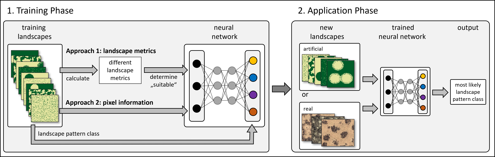

# spatPatClassifyR

The `spatPatClassifyR` package provides an automated approach to
classifying spatial vegetation patterns into user-defined pattern types.
It does so by training a neural network on multiple reference landscapes
with known pattern types. Two alternative neural network approaches are
implemented: (i) a multi-layered neural network, which is trained on
landscape metrics and (ii) a convolutional neural network trained on the
pixel data itself. Once trained, the neural network can be applied to
new landscapes with unknown spatial patterns. In doing so, it estimates
the likelihood for each possible pattern type, allowing users to assess
the confidence of the classification.

In the initial publication of the `spatPatClassifyR` package, two use
cases are demonstrated: different pattern types in ecotones and
different pattern types in self-organized landscapes. In both use cases
we show the performance of both neural network approaches dependent on
input configurations. For the self-organized landscapes, we additionally
demonstrate the application of neural networks trained with artificial
landscapes on real-world photographs.



## Installation

You can install the development version of spatPatClassifyR from
[GitHub](https://github.com/) with:

``` r
# install.packages("pak")
pak::pak("ecomods/spatPatClassifyR")
```

## Get started

After successful installation, get started by following the detailed
workflow description in: [Get
started](https://ecomods.github.io/spatPatClassifyR/spatPatClassifyR.md)

## Citation

To cite `spatPatClassifyR` in publications, please use:

Tietjen et al. (2026). …

To get a BibTex entry for citing, please use
`citation("spatPatClassifyR")`.

## Contributing

Please see our [contributing
guide](https://ecomods.github.io/spatPatClassifyR/CONTRIBUTING.html) for
details on how to get involved.

## Code of Conduct

Please note that the spatPatClassifyR project is released with a
[Contributor Code of
Conduct](https://ecomods.github.io/spatPatClassifyR/CODE_OF_CONDUCT.html).
By contributing to this project, you agree to abide by its terms.
