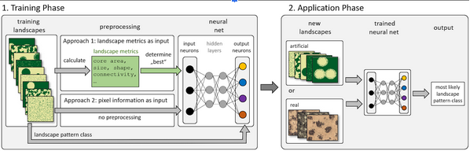

- Goal of the pkg: Classify spatial patterns in landscapes using machine learning techniques.

- Input to train the models are landscapes with known patterns from
  - a) synthetic landscape generator provided in the pkg
  - b) user-provided landscapes with known patterns

- Models can be trained using two approaches: 
  - calculate landscape metrics and use them as features for classification in a neural network
  - use convolutional neural networks (CNNs) to classify patterns directly from the pixel information of landscape images


- Model can then be applied to new landscapes
  - a) using new landscapes from the synthetic landscape generator
  - b) Using user-provided landscapes

- User provided landscapes must be converted to the pkg landscape format first.




```{r, include = FALSE}
knitr::opts_chunk$set(
  collapse = TRUE,
  comment = "#>"
)
```

## Basic Workflow Overview

The processes contain random components, so for reproducibility, we set a random seed at the beginning.

```{r setup}
library(spatPatClassifyR)
set.seed(12345)
```

### Generate training landscapes

To train the model, we can generate synthetic training landscapes of different patterns.
Below is a very simple example where we generate 100 landscapes with three different patterns.

For details on the landscape generation see the [Landscape Generation](landscape-generation.Rmd) vignette.

```{r generate_landscapes}
# Create a list of 100 training landscapes with all possible patterns
landscapes <- create_training_landscapes(n = 100)
```

To visualize some of the generated landscapes, we can use the `plot_landscapes()` function:

```{r plot_landscapes}
# Plots the first 36 training landscapes
plot_landscapes(landscapes)
```

### Train the classification model

#### Option A: Use landscape metrics as features

For details on this workflow, see [`vignette("landscape-metrics")`](landscape-metrics.Rmd)

- First: Landscape metrics from FRAGSTATS and [landscapemetrics](https://r-spatialecology.github.io/landscapemetrics/)

```{r}
# By default, calculates all available metrics on landscape scale
landscape_metrics <- calculate_landscape_metrics(landscapes)
```

- Second: Evaluate and select the most informative metrics depending on differnet methods
- Here: default method coeff_var

```{r}
selected_metrics <- evaluate_landscape_metrics(
  metrics = landscape_metrics,
  metrics_number = 10
)
```

We can plot the selected metrics to see which ones were chosen and how the different
landscape patterns differ in these metrics.

```{r}
plot_metrics(
  metrics = landscape_metrics,
  selected_metrics = selected_metrics
)
```


Now we use the metrics to train a NN. Here we train without cross-validation for simplicity.
See `vignette("landscape-metrics")` for more details.

```{r}
model <- train_nn_metrics(
  metrics = landscape_metrics,
  metrics_selected = selected_metrics,
  cv_method = "none"
)
```

Now we can create some test landscapes and classify them using the trained model.

```{r}
test_landscapes <- create_training_landscapes(n = 10)
validation_results <- apply_nn_metrics(
  landscapes = test_landscapes,
  nn_model = model
)
```

```{r}
plot_classified_landscapes(
  classification = validation_results,
  landscapes = test_landscapes,
  only_misclassified = FALSE
)
```


#### Option B: Use CNN to classify patterns directly from pixel information